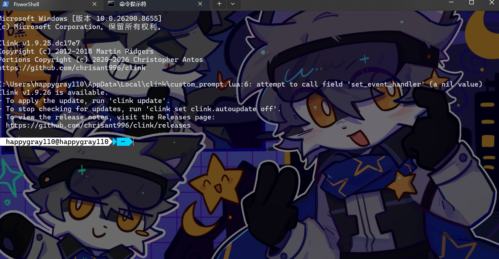

# Windows Terminal Beautifier

<p align="center">
  
  
  
</p>

<p align="center">
  一键美化 Windows PowerShell 和 CMD，让你的终端焕然一新！
</p>

<p align="center">
  
  
  
  
</p>

---

## 🌟 功能特点

- ✨ **PowerShell 7 美化** - 漂亮的三角形分隔符提示符
- 🎨 **CMD 美化** - 统一的美化风格
- ⚡ **Oh My Posh** - 强大的提示符主题引擎
- 🔧 **常用工具** - PSReadLine、Terminal-Icons、Clink
- 🎯 **智能别名** - 高效的命令行快捷方式
- 📦 **一键安装** - 完全自动化配置

---

## 🚀 快速开始

### 方法 1：自动安装（推荐）

```powershell
# 以管理员身份运行 PowerShell，然后执行：
irm https://raw.githubusercontent.com/yourusername/Windows-Terminal-Beautifier/main/install.ps1 | iex
```

### 方法 2：手动安装

1. 克隆仓库：
```bash
git clone https://github.com/yourusername/Windows-Terminal-Beautifier.git
```

2. 进入目录：
```bash
cd Windows-Terminal-Beautifier
```

3. 运行安装脚本：
```powershell
.\install.ps1
```

---

## 📸 效果预览

### PowerShell 7


### CMD


---

## 🎯 安装前要求

- Windows 10 或 Windows 11
- PowerShell 5.1 或更高版本
- 网络连接（用于下载依赖）

---

## 📋 安装内容

### 1. Oh My Posh
- 🚀 跨平台提示符主题引擎
- 🎨 支持自定义主题
- ⚡ 轻量级、快速

### 2. PowerShell 模块
- **PSReadLine** - 命令行编辑增强（语法高亮、自动补全）
- **Terminal-Icons** - 文件图标显示
- **z** - 快速目录跳转

### 3. CMD 工具
- **Clink** - CMD 增强工具
- 命令历史
- 自动补全
- 语法高亮

### 4. Nerd Fonts
- 安装 Powerline 字体
- 支持图标显示

### 5. 自定义别名

#### PowerShell 别名
```powershell
ls, ll, la    # 彩色文件列表
cat           # 语法高亮查看
which         # 查找命令位置
ep            # 快速编辑配置
Reload-Profile # 重载配置
```

#### CMD 别名
```cmd
ls, ll, la    # 彩色文件列表
cls           # 清屏
```

---

## 🔧 配置文件位置

- **PowerShell 5.1**: `C:\Users\<user>\Documents\WindowsPowerShell\Microsoft.PowerShell_profile.ps1`
- **PowerShell 7+**: `C:\Users\<user>\Documents\PowerShell\Microsoft.PowerShell_profile.ps1`
- **CMD (Clink)**: `C:\Users\<user>\AppData\Local\clink\custom_prompt.lua`
- **Oh My Posh 主题**: `C:\Users\<user>\.oh-my-posh\themes\custom.omp.json`

---

## 🎨 自定义主题

你可以修改主题文件来自定义提示符样式：

```powershell
code $env:USERPROFILE\.oh-my-posh\themes\custom.omp.json
```

### 主题配置选项

- `foreground` - 前景色（文字颜色）
- `background` - 背景色
- `leading_diamond` / `trailing_diamond` - 分隔符样式

---

## 🐛 故障排除

### 问题：提示符显示乱码

**解决方案：**
1. 安装 Nerd Fonts：
   - 下载 [Nerd Fonts](https://www.nerdfonts.com/)
   - 安装后重启终端

2. 设置终端字体：
   - 打开 Windows Terminal 设置
   - 选择 "Cascadia Code NF" 或 "FiraCode NF" 字体

### 问题：PowerShell 模块无法加载

**解决方案：**
```powershell
# 以管理员身份运行
Set-ExecutionPolicy -ExecutionPolicy RemoteSigned -Scope CurrentUser
```

### 问题：CMD 美化不生效

**解决方案：**
1. 完全关闭 CMD 窗口
2. 重新打开新的 CMD 窗口
3. Clink 需要新窗口才能加载配置

---

## 📝 更新日志

### v1.0.0 (2026-06-14)
- ✨ 初始版本发布
- ⚡ 支持 PowerShell 7 美化
- 🎨 支持 CMD 美化
- 🔧 集成 Oh My Posh
- 📦 包含常用工具和别名

---

## 🤝 贡献

欢迎提交 Issue 和 Pull Request！

1. Fork 本仓库
2. 创建分支 (`git checkout -b feature/AmazingFeature`)
3. 提交更改 (`git commit -m 'Add some AmazingFeature'`)
4. 推送到分支 (`git push origin feature/AmazingFeature`)
5. 创建 Pull Request

---

## 📄 许可证

本项目采用 MIT 许可证 - 详见 [LICENSE](LICENSE) 文件

---

## 👤 作者

**user**

- GitHub: [@yourusername](https://github.com/yourusername)

---

## 🙏 致谢

- [Oh My Posh](https://ohmyposh.dev/) - 强大的提示符引擎
- [PSReadLine](https://github.com/PowerShell/PSReadLine) - PowerShell 命令行增强
- [Clink](https://chrisant996.github.io/clink/) - CMD 增强工具
- [Nerd Fonts](https://www.nerdfonts.com/) - 图标字体
- [Powerlevel10k](https://github.com/romkatv/powerlevel10k) - Zsh 主题灵感

---

<p align="center">
  如果这个项目对你有帮助，请给一个 ⭐！
</p>
